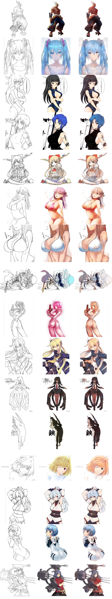

# Unet Image Translation

This repository implements image translation work; edge2color and color2edge.

## Requirements
* python3.6+
* pytorch 1.6.0
* others.

## Usage
training a model
```bash
python3 main.py --config config.yml
```

testing a model
```bash
Not implmented yet
```

## Results



## Reference
1. spectral normalization : https://github.com/christiancosgrove/pytorch-spectral-normalization-gan/blob/master/spectral_normalization.py
2. unet : https://github.com/milesial/Pytorch-UNet
3. dataset : https://www.kaggle.com/ktaebum/anime-sketch-colorization-pair
